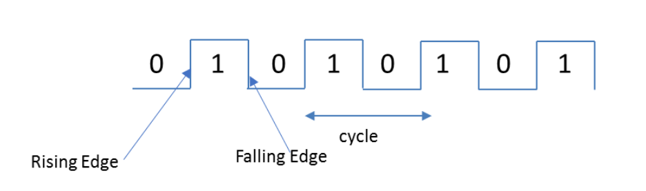

## Chapter 13: Clock Signal

_Originally created 22 March 2021, by Maxwell Hauser — Updated 8 October 2025._

_Builds upon material from Chapter 6: Complements and Chapter 7: Unsigned, Signed Magnitude and Signed Two’s Complement Binary Numbers._

### Overview

A clock signal is a sequence of 0s and 1s continuously repeated, as shown in the figure below. When the clock changes from 0 to 1, it is called the **rising edge** of the clock. When the clock changes from 1 to 0, it is called the **falling edge** of the clock.

> 

### Definitions
1. Clock:

    A clock is a signal that oscillates between a high and a low state, used to synchronize the operations of digital circuits. It provides a timing reference for the sequential logic in a system, ensuring that data is processed in a coordinated manner.

2. Rising Edge:
    The rising edge of a clock signal is the transition from a low state (0) to a high state (1). It is often used as a trigger for certain operations in digital circuits, such as latching data or initiating a state change.

3. Falling Edge:
    The falling edge of a clock signal is the transition from a high state (1) to a low state (0). Similar to the rising edge, it can also be used as a trigger for specific operations in digital circuits.

4. Cycle:
    Each cycle of the clock consists of a transition from 0 to 1 and back to 0 (or from 1 to 0 and back to 1). It is measured in time (seconds). If one cycle is represented by $T$ and the unit of $T$ is seconds, then the frequency $F$ is given by:
    
    $$F = \frac{1}{T}$$
    
    where the unit of frequency is Hertz (Hz) and the unit of $T$ is seconds.

5. Duty Cycle:  
    The duty cycle of a clock signal is the percentage of time that the signal is in the high state (1) during one complete cycle. It is typically expressed as a percentage, with a 50% duty cycle indicating that the signal is high for half of the cycle and low for the other half.

6. Frequency:
    The frequency of a clock signal is the number of complete cycles that occur in one second, measured in Hertz (Hz). It determines how fast the clock oscillates and is a critical parameter for the performance of digital systems. The relationship between frequency and period is:
    
    $$F = \frac{1}{T}$$
    
    where $F$ is frequency (Hz) and $T$ is period (seconds).

7. Period:
    The period of a clock signal is the duration of one complete cycle, measured in seconds. It is the inverse of the frequency, with a higher frequency resulting in a shorter period.

8. Phase:
    The phase of a clock signal refers to the relative timing of the signal with respect to another signal or a reference point. It is often measured in degrees or radians, with a full cycle corresponding to 360 degrees or $2\pi$ radians. A cycle of a clock signal is one complete oscillation from low to high and back to low (or vice versa). It consists of two main parts: the high state (1) and the low state (0).

9. Jitter:
    Jitter is the variation in the timing of a clock signal, which can lead to inaccuracies in data processing. It is typically measured in terms of time (e.g., nanoseconds) and can be caused by various factors, such as noise, interference, or imperfections in the clock generation circuitry.
10. Skew:
    Skew is the difference in timing between two or more clock signals that are intended to be synchronized. It can lead to timing errors in digital circuits, especially in high-speed systems, and is typically measured in terms of time (e.g., nanoseconds).

---

## Applications of Clock Signals

1. **Synchronization:** Clock signals synchronize operations in digital circuits, ensuring that data is processed at the correct time.
2. **Timing Reference:** Clocks provide a timing reference for sequential logic circuits, such as flip-flops and registers.
3. **Data Transmission:** Clock signals are used in communication systems to synchronize data transmission between devices.
4. **Microprocessors:** Clocks control the execution of instructions in microprocessors and CPUs.
5. **Memory Systems:** Clock signals coordinate read and write operations in memory systems.

---

## Summary

1. A clock signal is a periodic signal that oscillates between high (1) and low (0) states.
2. The rising edge is the transition from 0 to 1; the falling edge is the transition from 1 to 0.
3. Frequency is the number of cycles per second (Hz), and period is the duration of one cycle (seconds).
4. Duty cycle is the percentage of time the signal is high during one cycle.
5. Clock signals are essential for synchronizing operations in digital systems.